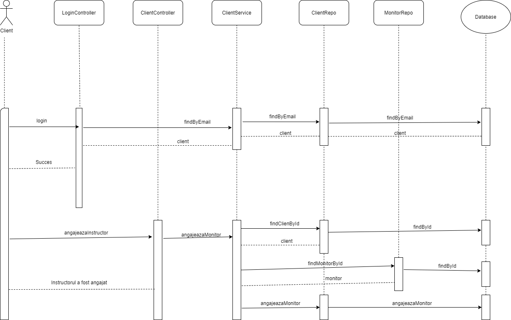

# Proiect PS

# Descrierea problemei 
Proiectul pe care l-am ales sa il implementez consta intr-o aplicatie desktop care faciliteaza viata unui schior care merge sa se relaxeze un weekend la munte.
Acesta aplicatie ofera urmatoarele informatii:
 - Toate echipamentele disponibile care se pot inchiria de la centrul de inchirieri
 - Toti monitorii de ski sau snowboard care lucreaza la acest centru de inchirieri 
 - Toti schiorii care s-au inscris in aplicatie 
 - - Numele acestora, email-ul lor, daca acestia au sau nu au echipament, daca acestia si-au angajat un instructor de ski
 - Un client poate sa vizualizeze ce echipamente are inchiriate 
 - Un client poate sa inchirieze un echipament/ sa angajeze un instructor de ski 
 - clientii si adminii se logheaza in functie de email-ul lor si parola asociata 
 - adminul este notificat de fiecare data cand un echipament este inchiriat
 - se poate genera un raport cu lista de inchirieri a fiecarui client, acesta se poate reprezenta in txt sau html.
 
Operatiile posibile asupra bazei de date sunt urmatoarele:
- inserarea unui client/unui echipament/unui admin/unui instructor de ski
- stergerea unui client/unui echipament/unui admin/unui instructor de ski
 - cautarea unui client/unui echipament/unui admin/unui instructor de ski 
 -unele operatii de update 
 -returnarea tuturor clientilor/tuturor echipamentelor/ tuturor instructorilor

 # API-uri folosite 
 API(application programming interface) reprezinta un set de reguli si specificatii pentru a putea programele sa comunice intre ele.
 
 In cadrul proiectului, vom folosi urmatoarele API-uri:
  - Postman
  - Mockito
  - Hibernate
  - Spring
  
 # Implementare 
 Aplicatia a fost scrisa folosind limbajul de programare Java prin intermediul IDE-ului IntelliJ. Pentru baza de date folosim MySql unde am creat o noua schema cu denumirea "ProiectPS". Legatura proiectului cu baza de date am realizat-o prin intermediul framework-ului "hibernate" pentru a se usura toata munca. In baza de date pana in momentul actual avem un numar de 4 tabele, dar legaturile intre ele inca nu s-au facut.
In intermediul aplicatiei avem in pachetul entity 4 clase principale care sunt scheletul aplicatiei. Datorita adnotarilor, dupa aceste clase s-au format tabelele. Pentru fiecare tabel avem cate o clasa repository unde avem implementate operatiile care se efectueaza asupra bazei de date. 
Aceste operatii le efectuam prin intermediul pachetului Service care face legatura repository-ului cu restul aplicatiei.
In aplicatie avem si un pachet pentru teste unde se testeaza diverse metode prin intermediul API-ului Mockito. 

 # Design-ul aplicatiei 
 Partea de front-end este realizata cu JavaScript, HTML si CSS. Avem 3 pagini principale:
    -pagina de login, unde introducem email-ul si parola, iar in functie de aceste campuri aplicatia ne directioneaza pe pagina html respectiva.  
    -pagina de admin, unde putem sa vizualizam toti clientii, toate echipamentele, toti instructorii, putem sa introducem/sa stergem din baza de date un client/un echipament/un instructor. Putem sa gasim un client dupa id, dupa email, etc.
    -pagina de client, unde putem sa vizualizam toate echipamentele disponibile si toti instructorii.De aici putem sa inchiriem un echipament sau sa il restituim, putem sa angajam un instructor sau sa il concediem, prin intermediul id-urilor personale. Putem sa generam un raport in diferite formate: txt sau html in care avem toate echipamentele inchiriate de o anumita persoana, si putem sa vizualizam si toate echipamentele unui client direct in interfata. 
    Design-ul este relativ simplu, acesta ar putea fi imbunatatit pe viitor.
    
 ``` javascript
 $(document).ready(function()    {
    $("#request_echipamente_disponibile").click(function(e)    {
        $.ajax({
            type: 'GET',
            url:'http://localhost:8080/EchipamenteDisponibile',
			dataType: 'json',
            success: function(data){
				
                var str="";
                $.each(data, function (i, echipament) {
                    str = str +echipament.id +" "+ echipament.nume + ", ";
                })
                $("#echipamente_disponibile").attr("placeholder", str); 
			},
            error: function(){
                $("#echipamente_disponibile").html("error")
            }

        });
    });


});   
```   

 
 # Interfata login


 # Interfata Admin


 # Interfata Client


 # Diagrama Use Case


 # Diagrama de pachete


 # Diagrama de clase pentru Patternul Factory 
 
 # Diagrama de secventa 
 
